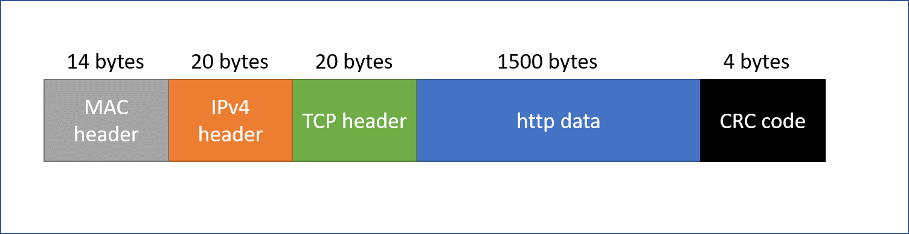

# Homework no. 1

## Submission

- Alexander Shender 328626114
- PUT YOUR NAME

____________

## Question #1

### (a)

The following chart shows the structure of the complete frame, where for each layer the according protocol is mentioned and the bytes number

| Layer        | Protocol           | Header size  |
|-|-|-|
| 5 | http | - |
| 4 | TCP | 20 |
| 3 | IPv4 | 20 |
| 2 | MAC + CRC | 14 + 4 |
| 1 | PHY | - |

The following diagram shows it explicitly:

 

 Thus, total size of the frame that the PHY layer receives is 1558 bytes.

<br/>
<br/>
<br/>

___________________

 ### (b)

For each of the paths, the following factors define the total amount of time required for the complete transaction:

1. The transmission time
2. The propagation time
3. The parsing - reparsing time

We calculate each one separately.

**1. The transmission time : T<sub>1</sub>**

As calculated, the frame has a total length of 1558 bytes = 12464 bits

Transmission time is calculated:

```python
time = data size /  transmission speed
```

- Cellphone <-> WiFI access point : 12464 / (20 * 10^6) = 0.6232 [ms]
- WiFI access point <-> R1 : 12464 /  (50 * 10^6) = 0.24928 [ms]
- R1 <-> R2 : 12464 /  (10 * 10^6) =  1.2464 [ms]
- R2 <-> R4 : 12464 /  (9 * 10^6) =  1.3849 [ms]
- R1 <-> R3 : 12464 /  (2 * 10^6) =  6.232 [ms]
- R3 <-> R4 : 12464 /  (2 * 10^6) =  6.232 [ms]
- R4 <-> Youtube server :  12464 /  (100 * 10^6) = 0.12464 [ms]

So, we can calculate the total transmission time for each path.

T<sub>1_path_1</sub> = 0.6232 + 0.24928 + 1.2464 + 1.3849 + 0.12464 = 3.62842 [ms] = 3.62842 * 10^-3 [s]

T<sub>1_path_2</sub> = 0.6232 + 0.24928 + 6.232 + 6.232 + 0.12464 = 13.46112 [ms] = 13.46112 * 10^-3 [s]

<br/>

**2. The propagation time : T<sub>2</sub>**

Those times are negligible: 

- Cellphone <-> WiFI access point
- WiFI access point <-> R1
- R4 <-> Youtube server

For others:

Speed of transmission  = (2/3) * (3 * 10^8) = 2 * 10^8  [m/s]

- R1 <-> R2 :    t = 3000  / (2 * 10^8) = 15 [us] = 15 * 10^-6 [s]
- R2 <-> R4 :    t = 10000 / (2 * 10^8) = 50 [us] = 50 * 10^-6 [s] 
- R1 <-> R3 :    t = 6000 / (2 * 10^8) = 30 [us] = 30 * 10^-6 [s] 
- R3 <-> R4 :    t = 5000 / (2 * 10^8) = 25 [us] = 25 * 10^-6 [s] 

Thus,

T<sub>2_path_1</sub> = (15 + 50) * 10^-6 = 65 * 10^-6 [s] </br>
T<sub>2_path_2</sub> = (30 + 25) * 10^-6 = 55 * 10^-6 [s]

**3. The parsing - reparsing time : T<sub>3</sub>**

For each on the paths, this time is equal. 

Assumptions:

- The Wi-Fi Access Point, R1, R2, R3, R3 only deal with the first 3 layers and do not parse the Layer 4 (Transpot layer) and Layer 5 (application)
- The Youtube serve does re-parsing of layer 4 & 5 (additionally to 1,2,3)
- The cellphone does parsing of layer 4 and 5 (additionally to 1,2,3)
- Each router does parsing and re-parsing of layer 2 and 3


So we get the total contribution of parsing - reparsing:

T<sub>3</sub> = T<sub>youtube</sub> + T<sub>R</sub> * 2 + T<sub>access_point</sub> + T<sub>cellphone</sub> </br>
T<sub>3</sub> = (2 * 3) + (2 * 1 + 2 * 2) * 2 + (2 * 1 + 2 * 2) + (1 * 3) [us] = 6 + 12 + 6 + 3 = 27 [us] = 27 * 10^-6 [s]

**TOTAL**

Thus, in total we obtain the following times:

Time<sub>path_1</sub> = T<sub>1_path_1</sub> + T<sub>2_path_1</sub> + T<sub>3</sub> = 3.62842 * 10^-3 + 65 * 10^-6 + 27 * 10^-6 [s] = 3.72042 * 10^-3 [s]


Time<sub>path_2</sub> = T<sub>1_path_2</sub> + T<sub>2_path_2</sub> + T<sub>3</sub> = 
13.46112 * 10^-3 +  55 * 10^-6 +  27 * 10^-6 [s] = 13.54312 * 10^-3 [s]


So, path 1 is faster (through R<sub>2</sub>). We can observe that the most decisive factor was the transmission speed. (its time is of an order higher than those of the propagation and parsing)

___________________

 ### (c)

 Now additional parsing and re-parsing of layer 4 header is added at the Wi-Fi access point. Thus, the total time for each path is increased by (1 + 2) [us] = 3 [us]

Time<sub>path_1_new</sub> =  3.72042 * 10^-3 + 3 * 10^-6 [s] = 3.72072 * 10^-3 [s]</br>
Time<sub>path_1_new</sub> =  13.54312 * 10^-3 + 3 * 10^-6 [s] = 13.54342 * 10^-3 [s]


____________

## Question #2

### (a)

Message length is 1 byte = 4 bits </br>
To ensure we can fix 1 error, the Hamming distance has to be equal at least 3. </br>

Using the equation from the lecture:

 

 where:
 - m = 4

we obtain that equation hold if:

- r = 3

Thus, we have to add 3 Control bits to each frame, making the total message length equal 7.</br>
The message will look in the following way, where C - control bits, D - data bits

 

___________________

 ### (b)

First, decoding HEX data to binary representation:</br>
each HEX digit has 4 bits of data (range of 0x0 - 0xF, where 0xF = 1111)

0xA09 = 1010 0000 1001

digits at places 1, 2, 4, 8 are control digits. We have to check the parity of all the bits those bits are responsible for and verify.

Again, with the help of the lecture:

 

Parity for each of those digits:

- 1 : even (3, 9)  -> parity = 0 : INCORRECT
- 2 : uneven (3)   -> parity = 1 : INCORRECT
- 4 : uneven (12)  -> parity = 1 : INCORRECT
- 8 : even (9, 12) -> parity = 0 : CORRECT

As we can see, the parity is incorrect for Control bits 1, 2, 4. Thus, if we only have 1 error max. , the incorrect bit is 7. 

And the correct message is:

1010 0010 1001 = 0xA29

The original message that will be passed further then consists without the control bits and is:

1001 1001 = 0x99


___________________

 ### (c)

Now we require a full table of the control bits:

 

#### a. 1111 1110 0110 000

Parity for each of control digits:

- 1 : even (3, 5, 7, 11)  -> parity = 0 : INCORRECT
- 2 : uneven (3, 6, 7, 10, 11)   -> parity = 1 : CORRECT
- 4 : uneven (5, 6, 7)  -> parity = 1 : CORRECT
- 8 : even (10 ,11) -> parity = 0 : CORRECT

The only incorrect control bit is '1', thus bit 1 is flipped. 

Correct word:

0111 1110 0110 000


#### b. 1111 1111 1111 111

All the control bits are responsible on 7 Data bits. All those bits are 1, making an uneven number of bits. Thus, the control bits should be Parity = 1 to make for legit word. This is what we see. So the word has no errors!


#### c. 1001 1010 1001 111

Parity for each of control digits:

- 1 : uneven (5, 7, 9, 13, 15)  -> parity = 1 : CORRECT
- 2 : uneven (7, 14, 15)   -> parity = 1 : INCORRECT
- 4 : even (5, 7, 12, 13, 14, 15)  -> parity = 0 : INCORRECT
- 8 : uneven (9, 12, 13, 14, 15) -> parity = 1 : INCORRECT

Bits 2, 4, 8 are incorrect. Thus, the incorrect bit in the message is 2 + 4 + 8 = 14. 

Correct word:

1001 1010 1001 101


____________

## Question #3 

First, we convert all the codes to the binary notation (assuming the it's the MSB-first code).

We obtain:

1. $R_1$ = 0x0 (g=5) = 0b0 = $X^5$
2. $R_2$ = 0x3B (g=6) = 0b1111011 = $X^6 + X^5 + X^4+ X^3 + X + 1$
3. $R_3$ = 0x13 (g=5) = 0b110011 = $X^5 + X^4 + X + 1$ 

### (a)

In the case when there are more than 1 error, we should use $R_2$ or $R_3$, which have more than 1 term in their polynomial. $R_1$, for example, will not detect the error in the fifth bit. (it will have no remainder)

### (b)

In the case where we have 1, 3, or 5 errors - the common thing between those is that those are all **odd** numbers.

Remembering the characteristic from the tutorial, if the $G(x)$ is divided by $(x+1)$ without any remainder, then **any odd** number of error bits will be discovered. We already know that $R_1$ will not divide $(x+1)$, so what is left to check are $R_2$ and $R_3$.

#### $R_2$:

```python
1111011
11
______
00
  11
  11
  __
  00
    011
     11
     __
     00
```

We can observe that for $R_2$ there is no remainder.


#### $R_3$:
```python
110011
11
______
00
  0011
    11
    __
    00
```

We can observe that for $R_3$ there is no remainder.

Both $R_2$ and $R_3$ will detect **any** amount of odd error bits, thus, we can choose the more optimal divisor - the one that its CRC code requires less bits. This will be $R_3$, which will require only 5 bits. But Emil chose $R_2$, whatever.


### (c)
Looking at the ASCII table for 'c', 's' chars, we get:

- c = 0x63
- s = 0x73

So the complete 'clean' message is 0x6373 = ‭0110 0011 0111 0011‬

Now, calculating the $T(x) = x^gM(x) - [(x^gM(x) \%  G(x)]$


### (d) 

We are required we check whether the errors of the type: 

$$E(x) = x^{k+7} + x^k = x^k (x^7 + 1)$$

will be detected. We have to check whether the $(x^7 + 1)$ will divide $R_2$ with no remainder. 

```python
10000001
1111011
______
01110111
 1111011
 _______
 0001100
 _______
    1100
```

We can see that there is a remainder. Which means that we do detect the error. 


### (e)

The message received is $T(x)$ = 0x1B0B = 0001 1011 0000 1011‬

We have to divide it by the Divisor $R_2$ and see if we get any remainder left. If we do, then **for sure** there is an error inside.

Performing the division:

```python 
1101100001011‬
1111011
_______
  1011100
  1111011
  _______
   1001111
   1111011
   _______
    1101000
    1111011
    _______
      1001111
      1111011
      _______
       110100
```
We can see that the remainder is not equal 0.

This means there is an error inside the message and we have to resend it. There is no way to detect which bit exactly was erroneous, we also don't know how many erroneous bits were received.


____________

## Question #4


### (a) 

We are given: the probability of 1 erroneous bit: $p = 5 \times 10^6$.

The probability of a successful bit: $(1-p)$

One frame contains 12500 bytes, which is $10^5$ bits.
The chance to receive the frame with no error, meaning all bits are received correctly, is:

<span style="font-size:16px;">

$$P_{success} = (1-p)^{10^5} \approx 0.607$$

</span>

Likewise, the chance to receive 1 bit with error is:

<span style="font-size:16px;">

$$P_{one\_bit\_error} = (10^5)\times(p\times(1-p)^{10^5-1}) \approx 0.303$$

</span>

where we multiplied the probability of some bit to be erroneous by a number of total bits.


### (b)

We are given a new measure, we denote it $S_{ch}$:

<span style="font-size:16px;">

$$S_{ch} = \frac{bits\ number\ in\ a\ frame}{frame\ average\ length} = \frac{N_{bits}}{F_v}$$

</span>

We consider each case separately:

#### (1) 

**Correction** code adds 100 bits, and requires no additional sendings to be performed, thus:

<span style="font-size:16px;">

$$S_{ch1} = \frac{10^5}{10^5 + 100} \approx 0.999$$

</span>


**Detection** code adds 10 bits, but that means we will have to send the erroneous frame again (which is successful by exercise condition). We define M - random variable symbolizing the amount of messages sent. Due to the geometric probability:

<span style="font-size:16px;">

$$E(M) = \frac{1}{P_{successful\ frame}} = \frac{1}{0.607} = 1.65$$

</span>

Thus, the average frame length and the throughtput:

<span style="font-size:16px;">

$$F_v = E(M) \times (10^5 + 10) = 1.65 \times (10^5 + 10) = 165016.5 [bits] $$

$$S_{ch2} = \frac{10^5}{165016.5} \approx 0.606  $$

</span>

Consequency, we obtain:

<span style="font-size:16px;">

$$S_{ch1} > S_{ch2}$$

</span>

Which means that throughput of the correction code is higher and on average more bits will be transmitted in the same amount of time.


#### (2)

Doing the same calculations as before, briefly:

**Correction**

<span style="font-size:16px;">

$$S_{ch1} = \frac{10^5}{10^5 + 29000} \approx 0.775$$

</span>


**Detection**

<span style="font-size:16px;">

$$F_v = E(M) \times (10^5 + 500) = 1.65 \times (10^5 + 500) = 165825 [bits] $$

$$S_{ch2} = \frac{10^5}{165825} \approx 0.603 $$

</span>

And we get:

<span style="font-size:16px;">

$$S_{ch1} > S_{ch2}$$

</span>

Which means that still, the **correction** code gives better throughput.


